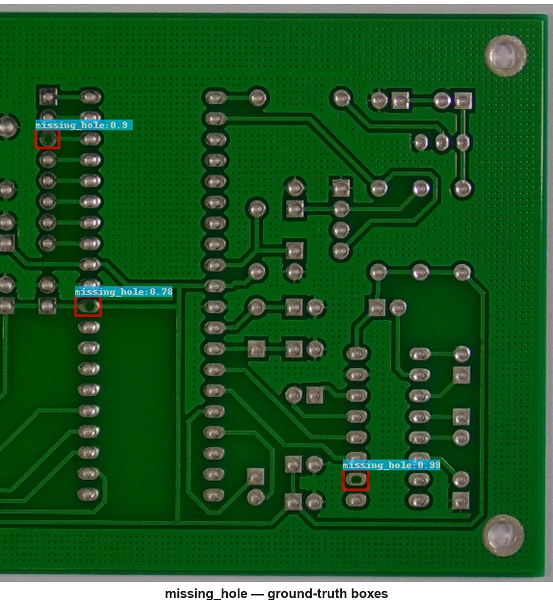
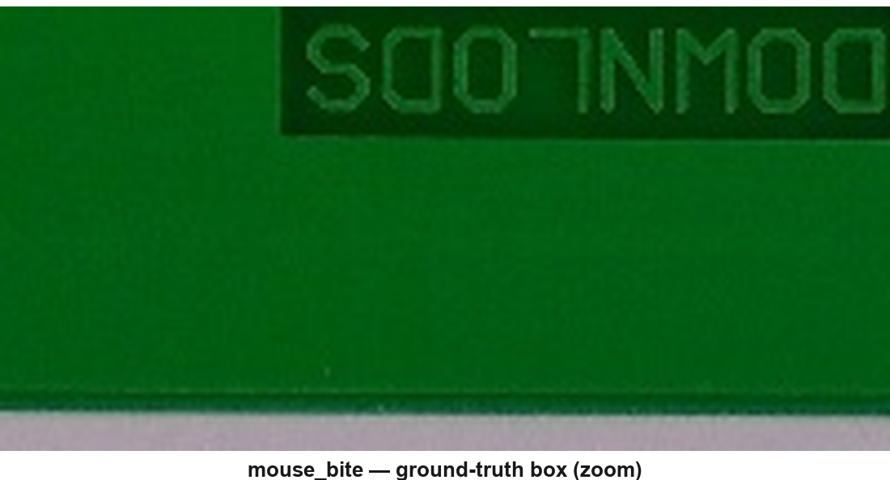

# lld-net-pcb-ml — LLD-Net PCB experiments

<p align="center">
  <br/>
  
</p>

<p align="center"><sub>PKU-Market-PCB (600×600 crops) — red boxes = ground truth, labels show class and score.</sub></p>

[](https://github.com/usarrahim/lld-net-pcb-ml)
[](https://www.python.org/downloads/)
[](https://docs.ultralytics.com/)

```bash
git clone https://github.com/usarrahim/lld-net-pcb-ml.git
cd lld-net-pcb-ml
```

> **LLD-Net** (*Low-Level Defect detector Network*) routes the **stride-4 / 160×160 P2 feature map** of a YOLOv12n backbone into the detection head so that defects only a few pixels wide stay spatially resolved under sensor noise. This repository holds the **ML notebooks, training runs, and report builder** for those experiments (GitHub: **lld-net-pcb-ml**; previously **lld-net-pcb**).

**Stack:** Python 3.10+, Ultralytics YOLOv12, PyTorch (GPU recommended). The notebooks are written for Google Colab with a Drive-mounted project folder, but the paths are easy to retarget for a fully local setup.

---

## 1. Overview

PCB assembly inspection has to detect microscopic defects (shorts, opens, mouse bites, spurs, spurious copper, missing holes) on a fast-moving production line. The reference work for this task is **TDD-Net** by Ding *et al.* [2], which trains a Faster-R-CNN-style tiny-defect detector on the PKU-Market-PCB augmented release (10,668 colour images, six defect classes, ten illumination conditions). LLD-Net targets the same dataset and taxonomy with a modern single-stage backbone and a focus on the small-defect / sensor-noise regime:

| # | Contribution | Primary artifact |
|---|----------------|------------------|
| 1 | YOLOv12n baseline trained on the PKU-Market-PCB family (10,668 colour images) | `train_yolov12_pcb.ipynb` |
| 2 | **P2 (stride-4)** detection head for tiny defects | `cfg/yolo12n_p2.yaml`, `p2_noise_ablation.ipynb` |
| 3 | **Gaussian-noise** robustness study (σ ∈ {10, 20, 30}) on the test set | `p2_noise_ablation.ipynb` |
| 4 | **TTA** and **high-resolution** inference (no retraining) | `p2_noise_ablation.ipynb` |
| 5 | **Multi-illumination** analysis (per-`light_NN` subsets) | `illumination_robustness.ipynb` |
| 6 | Reporting: curves, confusion matrices, per-class metrics, galleries | `report_visualization.ipynb` |

---

## 2. Repository layout

```
lld-net-pcb-ml/
├── README.md
├── docs/images/                   # README gallery (PKU-Market-PCB samples)
├── .gitignore
│
├── XmlToYolo.ipynb                # VOC XML → YOLO labels + data.yaml
├── train_yolov12_pcb.ipynb        # Baseline YOLOv12n training
├── p2_noise_ablation.ipynb        # P2 training + noise + TTA + high-res
├── illumination_robustness.ipynb  # Per-illumination evaluation (no training)
├── report_visualization.ipynb     # Figures, tables, sample/failure galleries
│
├── cfg/yolo12n_p2.yaml            # YOLOv12n + P2 head
│
├── runs_pcb/                      # Training outputs (best.pt / last.pt; epoch*.pt ignored)
│   ├── yolo12_pcb_baseline/
│   └── yolo12n_p2_strong/
│
├── ablation_outputs/              # From p2_noise_ablation.ipynb
├── illumination_outputs/          # From illumination_robustness.ipynb
└── report_outputs/                # From report_visualization.ipynb
```

The image corpus and the source Pascal-VOC archive are intentionally kept out of git (see `.gitignore`); use the download link in §3 instead.

---

## 3. Dataset

**Six classes:** `missing_hole`, `mouse_bite`, `open_circuit`, `short`, `spur`, `spurious_copper`. **10,668** RGB images at **600×600**, **21,664** boxes, split **5,120 / 3,414 / 2,134** (train / val / test). Image filenames encode lighting as `light_<NN>_…`; the test split contains **10** distinct illumination IDs.

The corpus is the **PKU-Market-PCB augmented release** introduced together with TDD-Net by Ding *et al.* [2] and originally published by the Open Lab on Human-Robot Interaction at Peking University [3]. Please cite both works if you use the data.

The pre-built YOLO-format dataset (`images/`, `labels/`, `data.yaml`) is mirrored on Google Drive:

**Dataset download:** <https://drive.google.com/drive/folders/1RVGEKcHiyl9MtZOb6cEtDxVC2H6bYvsO?usp=sharing>

Place the contents under `PCB_DATA_YOLO/` next to the notebooks (or under `MyDrive/lld-net-pcb-ml/PCB_DATA_YOLO/` if you work on Colab). If you start from the original Pascal-VOC release, `XmlToYolo.ipynb` performs the conversion.

---

## 4. Environment setup

**Recommended:** Google Colab + GPU (T4 / L4 / A100) with the project mirrored to Drive at `/content/drive/MyDrive/lld-net-pcb-ml/`. Each training notebook copies `PCB_DATA_YOLO/` to a local SSD path under `/content/` for fast I/O, then syncs `runs_pcb/` and the CSV outputs back to Drive so work survives session disconnects.

**Local (optional):**

```bash
pip install ultralytics pyyaml opencv-python pandas matplotlib seaborn
```

A CUDA GPU is strongly recommended for training; CPU is fine for light evaluation only.

---

## 5. How to reproduce

Run the notebooks **in order**:

1. **`XmlToYolo.ipynb`** — Converts `VOC_PCB/` → `PCB_DATA_YOLO/` + `data.yaml`. Skip if you downloaded the YOLO archive above.
2. **`train_yolov12_pcb.ipynb`** — Trains the YOLOv12n baseline (~100 epochs, imgsz 640) → `runs_pcb/yolo12_pcb_baseline/`.
3. **`p2_noise_ablation.ipynb`** — Trains the P2 model from `cfg/yolo12n_p2.yaml` with the strong-augmentation profile, generates Gaussian-noise test copies (σ = 10, 20, 30), and runs TTA + `imgsz=960` ablations → `ablation_outputs/`.
4. **`illumination_robustness.ipynb`** — Splits the test set by `light_<NN>` (10 subsets) and runs `model.val()` for both models → `illumination_outputs/`.
5. **`report_visualization.ipynb`** — Regenerates report and presentation figures from the CSVs → `report_outputs/`.

Approximate Colab runtimes (T4): XmlToYolo ~3 min; baseline ~1.5–2.5 h; P2 + ablations ~2.5–3.5 h; illumination ~10 min; report figures ~10 min.

---

## 6. Metrics

| Metric | Role |
|---|---|
| mAP@0.5 | Primary detection metric (IoU = 0.5) |
| mAP@0.5:0.95 | COCO-style strict metric |
| Precision / Recall / F1 | Standard reporting at conf = 0.25, IoU = 0.5 |
| FNR | False-negative rate ≈ 1 − recall (inspection-oriented) |
| FPS | Throughput on a single Tesla T4 (clean test images) |

---

## 7. Results

Numbers come from `ablation_outputs/`, `illumination_outputs/`, and `report_outputs/`. Plots live under `report_outputs/plots/` and `illumination_outputs/plots/`.

**Clean test split**

| Model | mAP@0.5 | mAP@0.5:0.95 | F1 | FNR | FPS |
|---|---|---|---|---|---|
| YOLOv12n baseline | **0.9885** | **0.6130** | 0.9862 | 0.0088 | 90.65 |
| YOLOv12n + P2     | 0.9879   | 0.5942   | 0.9831 | 0.0177 | 92.24 |

The two models are effectively tied on clean data (the benchmark is saturated near 0.99).

**Headline finding — Gaussian noise**

| σ | Baseline mAP@0.5 | P2 mAP@0.5 | Δ | Baseline FNR | P2 FNR | FNR ↓ (pp) |
|---|---|---|---|---|---|---|
| 0  | 0.9885 | 0.9879 | −0.0006 | 0.009 | 0.018 | −0.9 |
| 10 | 0.9811 | 0.9798 | −0.0013 | 0.040 | 0.038 | +0.2 |
| **20** | **0.6479** | **0.7525** | **+0.1046** | **0.412** | **0.326** | **+8.6** |
| 30 | 0.2067 | 0.2469 | +0.0402 | 0.796 | 0.783 | +1.3 |

At σ = 20, P2 gains **+10.5 pp** mAP@0.5 and **−8.6 pp** FNR. See `report_outputs/plots/noise_robustness.png`.

**Per illumination (10 conditions, test split)** — Mean mAP@0.5: 0.9864 (baseline) vs. 0.9861 (P2). Hardest condition: `light_09`; easiest: `light_11`. Aggregate behaviour is tied; P2 does not buy global illumination invariance (expected, since illumination is a global perturbation).

**Per class (clean test)** — P2 wins on the two smallest classes by area: `missing_hole` (+0.0024 AP@0.5) and `mouse_bite` (+0.0012). Other classes differ by ≤ 0.0023.

---

## 8. References

[1] G. Jocher and J. Qiu, *Ultralytics YOLOv12: Attention-Centric Real-Time Object Detection*. Ultralytics, 2024. <https://docs.ultralytics.com/models/yolo12/>

[2] R. Ding, L. Dai, G. Li and H. Liu, *TDD-Net: A Tiny Defect Detection Network for Printed Circuit Boards*, CAAI Transactions on Intelligence Technology, vol. 4, no. 2, pp. 110–116, 2019. doi: [10.1049/trit.2019.0019](https://doi.org/10.1049/trit.2019.0019). Code: <https://github.com/Ixiaohuihuihui/Tiny-Defect-Detection-for-PCB>

[3] Open Lab on Human-Robot Interaction, Peking University, *PKU-Market-PCB Defect Dataset*. Distributed by the dataset authors via the TDD-Net repository [2].

[4] D. Hendrycks and T. Dietterich, *Benchmarking Neural Network Robustness to Common Corruptions and Perturbations*, ICLR 2019. <https://arxiv.org/abs/1903.12261>

---

## 9. Acknowledgements

The dataset and the original tiny-defect detection task are due to Ding *et al.* (TDD-Net) [2] and the Open Lab on Human-Robot Interaction at Peking University [3]. The detector backbone is **YOLOv12** by **Ultralytics** [1]. Experiments were run primarily on **Google Colab** with GPU.
