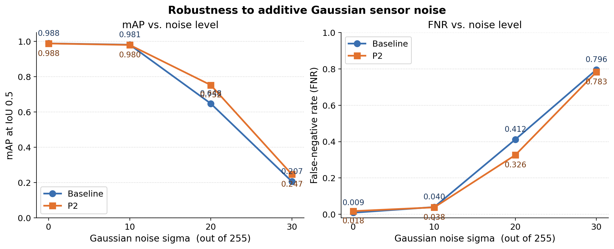
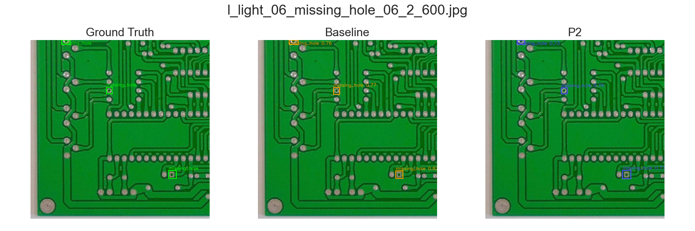
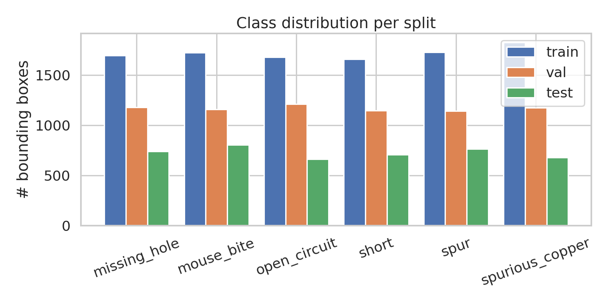

# LLD-Net

**Tiny-defect detector for printed circuit boards.**  
YOLOv12n + a stride-4 **P2** head so defects a few pixels wide stay spatially resolved under sensor noise.

<p align="center">
  
</p>
<p align="center"><sub>P2 detections on a PKU-Market-PCB 600×600 crop — <code>missing_hole</code> with confidence.</sub></p>

<p align="center">
  
  
  
  
  
</p>

On the clean test split both models sit at **~0.99 mAP@0.5**. The interesting result is noise: at Gaussian σ = 20 the P2 head recovers **+10.5 pp mAP@0.5** and **−8.6 pp FNR** versus the stock YOLOv12n baseline.

<p align="center">
  
</p>

| σ | Baseline mAP@0.5 | P2 mAP@0.5 | Δ | Baseline FNR | P2 FNR |
|---:|---:|---:|---:|---:|---:|
| 0 | 0.988 | 0.988 | −0.001 | 0.009 | 0.018 |
| 10 | 0.981 | 0.980 | −0.001 | 0.040 | 0.038 |
| **20** | **0.648** | **0.752** | **+0.105** | **0.412** | **0.326** |
| 30 | 0.207 | 0.247 | +0.040 | 0.796 | 0.783 |

---

## Method

Standard YOLOv12n detects at P3–P5 (stride 8 / 16 / 32). LLD-Net adds a **P2 / stride-4** branch (160×160 at 640 input) so the smallest copper defects are not spatially pooled away.

```
backbone ─ P2/4  160×160 ─┐
          P3/8   80×80  ─┤
          P4/16  40×40  ─┼─ Detect(P2, P3, P4, P5)
          P5/32  20×20  ─┘
```

Config: [`cfg/yolo12n_p2.yaml`](cfg/yolo12n_p2.yaml). Matching layers are warm-started from `yolo12n.pt`; the new P2 path is trained from scratch. P2 is trained with a stronger augmentation profile (mosaic, mixup, copy-paste; `flipud=0` — a PCB is not upside-down on a line). The baseline uses Ultralytics defaults. The σ = 20 gain is therefore **P2 + strong aug vs stock YOLOv12n**, not a pure architecture ablation.

<p align="center">
  
</p>
<p align="center"><sub>Same crop: ground truth · baseline · P2.</sub></p>

---

## Results

Test set: **2,134** images, **4,349** boxes, Tesla T4, `imgsz=640`, `conf=0.25`.

| | mAP@0.5 | mAP@0.5:0.95 | F1 | FNR | FPS |
|---|---:|---:|---:|---:|---:|
| YOLOv12n | **0.9885** | **0.6130** | **0.986** | **0.009** | 90.7 |
| YOLOv12n + P2 | 0.9879 | 0.5942 | 0.983 | 0.018 | **92.2** |

Clean-data performance is saturated. P2’s gain is the **σ = 20** noise regime above. TTA and 960-px inference did not improve clean mAP (both models already ≥ 0.988). Across 10 illumination IDs the two models stay tied (mean mAP@0.5 0.986) — expected, because lighting is a global shift, not a small-object problem.

P2 is slightly ahead on the two smallest classes (`missing_hole`, `mouse_bite`). Full CSVs and plots live under `ablation_outputs/`, `illumination_outputs/`, and `report_outputs/`.

---

## Dataset

[PKU-Market-PCB](https://github.com/Ixiaohuihuihui/Tiny-Defect-Detection-for-PCB) (TDD-Net release): 10,668 RGB images at 600×600, six defect classes, ten lighting conditions.

| Split | Images | Boxes |
|---|---:|---:|
| train | 5,120 | 10,306 |
| val | 3,414 | 7,009 |
| test | 2,134 | 4,349 |

Classes: `missing_hole` · `mouse_bite` · `open_circuit` · `short` · `spur` · `spurious_copper`

<p align="center">
  
</p>

YOLO-format archive (images, labels, `data.yaml`):  
https://drive.google.com/drive/folders/1RVGEKcHiyl9MtZOb6cEtDxVC2H6bYvsO?usp=sharing

Place it at `PCB_DATA_YOLO/` next to the notebooks. From the original VOC tree, run `XmlToYolo.ipynb`.

---

## Quick start

Weights are **in this repo** (~5–6 MB each). No extra download for inference.

```bash
git clone https://github.com/usarrahim/lld-net-pcb-ml.git
cd lld-net-pcb-ml
pip install -r requirements.txt

python infer.py path/to/board.jpg            # P2
python infer.py path/to/board.jpg --model baseline
```

| Model | Checkpoint | Size |
|---|---|---:|
| YOLOv12n baseline | `runs_pcb/yolo12_pcb_baseline/weights/best.pt` | 5.3 MB |
| YOLOv12n + P2 | `runs_pcb/yolo12n_p2_strong/weights/best.pt` | 5.6 MB |
| Baseline ONNX | `runs_pcb/yolo12_pcb_baseline/weights/best.onnx` | 10.1 MB |

Training was done on Colab (T4 / L4). Notebooks also run locally: `project_paths.py` picks Drive+SSD cache on Colab and the repo folder on a laptop.

---

## Reproduce

| # | Notebook | What it does |
|---|---|---|
| 1 | `XmlToYolo.ipynb` | VOC XML → YOLO labels + `data.yaml` |
| 2 | `train_yolov12_pcb.ipynb` | Baseline, 100 epochs, `imgsz=640` |
| 3 | `p2_noise_ablation.ipynb` | P2 training, σ ∈ {10,20,30}, TTA, imgsz=960 |
| 4 | `illumination_robustness.ipynb` | Per-`light_NN` eval (no retraining) |
| 5 | `report_visualization.ipynb` | Curves, matrices, galleries |

Seed **42**, batch **16**, patience **30**. Colab T4 wall-clock: baseline ~2 h, P2 + ablations ~3 h, the rest minutes.

---

## Layout

```
cfg/yolo12n_p2.yaml          P2 architecture
infer.py                     single-image / folder demo
project_paths.py             Colab ↔ local path resolver
runs_pcb/.../weights/        trained checkpoints
ablation_outputs/            noise / TTA / high-res CSVs
illumination_outputs/        per-light metrics
report_outputs/              plots + sample / failure galleries
```

---

## References

1. G. Jocher and J. Qiu, *Ultralytics YOLOv12*. https://docs.ultralytics.com/models/yolo12/
2. R. Ding, L. Dai, G. Li, H. Liu, *TDD-Net: A Tiny Defect Detection Network for Printed Circuit Boards*, CAAI TIT 4(2), 2019. [doi:10.1049/trit.2019.0019](https://doi.org/10.1049/trit.2019.0019)
3. Open Lab on Human-Robot Interaction, Peking University — PKU-Market-PCB.
4. D. Hendrycks, T. Dietterich, *Benchmarking Neural Network Robustness to Common Corruptions*, ICLR 2019.

MIT for this repository. Ultralytics is [AGPL-3.0](https://github.com/ultralytics/ultralytics). Cite [2] and [3] if you use the dataset.
